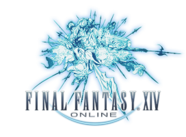

(C) SQUARE ENIX CO., LTD. All Rights Reserved.

FF14はDirectXをヘビーに使っているソフトウェアであり、OpenGL等のオープンなAPI上では動作しない。
このため、これまでFF14をLinuxで動かそうとする際にはWine+Gallium9 Direct Rendering(Direct3D9の描画コマンドを直接送信するモードで、AMDのみ対応)等の特殊な技法を用いる必要があった。
しかし、近年のWineD3Dの活発な開発、および[DXVK](https://github.com/doitsujin/dxvk)の登場により、
Direct3D9はおろかDirect3D11までほとんどネイティブに近い速度で動作させることが可能となっているらしい。

ということで、今回はFF14をLinux(ArchLinux)で動かすのに必要なことをまとめてみる。

# パッケージのインストール

## ランタイム(Wine + ドライバ)

以下をインストールする

- wine系
  - [wine](https://www.archlinux.jp/packages/multilib/x86_64/wine)
  - [wine-mono](https://www.archlinux.jp/packages/community/x86_64/wine-mono)
  - [wine-gecko](https://www.archlinux.jp/packages/community/x86_64/wine-gecko)
- [lib32-gnutls](https://www.archlinux.jp/packages/multilib/x86_64/lib32-gnutls)
  - HTTPS System Errorを回避するため
- lib32のvulkan driver (以下のうちいずれか)
  - NVIDIA
    - [lib32-nvidia-utils](https://www.archlinux.jp/packages/multilib/x86_64/lib32-nvidia-utils)
  - AMD
    - [lib32-vulkan-radeon](https://www.archlinux.jp/packages/multilib/x86_64/lib32-vulkan-radeon)
    - [lib32-amdvlk](https://www.archlinux.jp/packages/multilib/x86_64/lib32-vulkan-radeon)
    - [lib32-vulkan-amdgpu-pro](https://aur.archlinux.org/packages/lib32-vulkan-amdgpu-pro) (AUR)
  - Intel
    - [lib32-vulkan-intel](https://www.archlinux.jp/packages/multilib/x86_64/lib32-vulkan-intel)

## DXVK

DXVKはWineプリフィックス内にインストールするものなので、セットアップスクリプト(setup_dxvk.sh)の形で提供されている。
最新版はAUR([dxvk-bin](https://aur.archlinux.org/packages/dxvk-bin))からインストールして`setup_dxvk`コマンドとして利用可能。

AURからインストールするかGitHubからtar.gzをダウンロードして`setup_dxvk(.sh)`を実行できるようしておく。
(Wineプリフィックスへのインストールはまだ行ってはならない)

{}
最新のDXVK(2.0)を使う場合、GPUがVulkan1.3をサポートしている必要がある。
古いGPU(NVIDIA Kepler以前およびAMD Polaris以前)の場合はVulkan 1.2以前しかサポートしないため、
GitHubからDXVK 1.xをダウンロードして使う必要がある。

[Releases - doitsujin/dxvk](https://github.com/doitsujin/dxvk/releases)
{}

# FF14のインストール

## インストーラーのダウンロード

以下のページからインストーラー(`ffxivsetup_ft.exe`)をダウンロードする。

[ファイナルファンタジーXIV フリートライアル | SQUARE ENIX](https://www.finalfantasyxiv.com/freetrial/download/)

## インストーラーの実行

インストーラーを立ち上げるとリージョン選択ダイアログが出るので、一番下の「日本語」(文字化けしている)を選択する。



起動後もほとんど文字化けしてしまっているが、基本的には真ん中右側の「次へ(N)」ボタンを押し続ければ良い。



# 初回起動

## ランチャーの起動

ここまで出来たら、デスクトップアイコンからランチャーを起動する。
(デスクトップ上のアイコンを利用できない場合、`wine '~/.wine/drive_c/Program Files (x86)/SquareEnix/FINAL FANTASY XIV - A Realm Reborn/boot/ffxivboot.exe'`のようにして直接実行する。)

起動すると、以下のような画面が表示される。



この時点で**エラーも何も出ずこの画面のまま進まなければ成功である。**

インストールがうまく行っていることが分かったら一旦この画面を閉じる。

{}
ランチャーを起動したときに「HTTPS System Error」が出てしまう場合、
Wineプリフィックスの内容がクリーンでなく、FF14の実行に適さない状態になっていた可能性がある。
(先に`setup_dxvk install`を実行してしまった場合などに起こりがち)

このような場合、以下の手順でインストールをやり直すと良い。

1. 既定のWineプリフィックス(`~/.wine`)を削除するか、`WINEPREFIX`に新しいパスを指定する。
1. `ffxivsetup_ft.exe`を実行する。(この時点ではじめてWineプリフィックスのセットアップが走るはず)
1. もう一度ランチャーを起動する。

これでもまた出てしまう場合、`lib32-gnutls`が正しくインストールされているか確認する。
{}

## DXVKのインストール

先程準備したDXVKを使って、`setup_dxvk(.sh) install`を実行する。
すると、現在のWineプリフィックスに各種d3dのdllがインストールされる。

## ランチャータイプの変更

先程起動したのは新しいタイプのランチャーであるため、古いものに変更する。
`$HOME/My Games`または`$HOME/Documents/My Games`以下にFF14のディレクトリがあるはずなので開き、
`FFXIV_BOOT.cfg`を以下のように編集する。

- `Browser`を`3`に変更
- `BrowserType`を`2`に変更

編集できたらランチャーを再度起動する。

## ランチャーの起動(再)

ここまで来たら古いランチャーがうまく立ち上がるはずなので、フリートライアルの開始手続き(ログイン)を画面に従って行う。
完了したらダウンロードが始まるので、右下の「CONFIG」を開いてDirectX11モードが利用できるかどうか確認する。



「DirectX 11 モード」のトグルを操作可能であればDirectX11が正しくセットアップされている。
グレーアウトしてしまっている場合はDXVKがうまく起動していないため、
GPUドライバおよびVulkanドライバが正しくインストールされているかどうかを再度確認する。

## ゲームの起動

ダウンロードが完了したら「プレイ」を押してゲームを起動する。
すると、初回起動のため以下のような4項目のメニューが出現する。



この状態で「GAME START」を押すと初回のムービー再生が始まるのだが、
**Wine上ではこのムービーの再生に対応しておらず、フリーズしてしまう。**
このため、ムービー視聴済フラグをいじることでこのムービーをスキップする。

一旦ゲームを閉じて、先ほどと同じくFF14のディレクトリを開く。
今度は`FFXIV.cfg`を開いて、`CutsceneMovieOpening`を`1`に変更して保存する。
(ちなみに`FFXIV.cfg`は1回以上ゲーム本体を起動しないと作成されない)

編集が完了したら再度ゲームを起動する。
以降は通常通りプレイすることができるはずである。

# 実際のプレイ感

実際プレイしてみて、パフォーマンス自体はWindowsでプレイしていた場合とほぼ遜色ないように感じる。
また、ゲームパッドもUSBで接続するだけで特別な設定等せずとも使用することが出来た。

Windowsに切り替えることなくゲームをプレイできるようになり、ますますLinuxオンリーでの生活が捗りそうだ。
