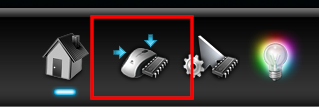

FF14をプレイする上で手放すことが出来ないものの一つが多ボタンマウスである。
Logicool G600は言わずと知れた多ボタンマウスの名機で、
側面に12個のボタンを備えている上、G-shiftボタンを押しながら使うことにより、
さらに追加で12個のアクションを切り替えて使うことが可能となっている。

ただ、得てしてこの手のデバイスはWindows専用のソフトやドライバが必要になるものである。
今回はそんなG600をLinuxで扱う方法について見ていく。

なお、今回このデバイスを使うに当たって、Linux上にインストールしたFF14を用いる。
FF14をLinux上にインストールする方法については以下の記事を参照。

[FF14をArchLinuxで動かす(DirectX11対応) | Arch使いの日記](/post/ff14-on-linux/)

# 概要

Logicool公式から提供されるG600のドライバはWindows用のものしかないのだが、
「オンボードメモリモード」というG600の機能を用いることで専用ドライバがなくとも側面ボタンを使えるようになる。

具体的には以下の手順によりLinux上でG600を使えるようにする。

1. Windows上に、Logicool Gaming Softwareをインストールする
1. Logicool Gaming Softwareでオンボードメモリモードを有効にする
1. Logicool Gaming Softwareで各ボタンにキーを割り当てる
1. 設定したマウスをLinuxに接続して使用する

このように、G600の最初の設定の段階でどうしてもWindows環境が必要となる。
もしWindoows環境を持っていない場合でも、
Windows10のインストールイメージは[Microsoft公式から入手することができる](https://www.microsoft.com/ja-jp/software-download/windows10ISO)ため、
これを一時的に用いて設定を行うといいだろう。

## 1. Logicool Gaming Softwareのインストール

Logicool Gaming Software(以下LGS)は、Logicoolのゲーミングデバイスを設定するためのユーティリティである。
現在では新しい設定ユーティリティのGHUBに置き換えられているのだが、GHUBだとG600の一部の設定がうまく出来ないため、
今回はLGSの方を用いる。

なお、公式からは既にダウンロードできなくなっているが、Internet Archiveから引き続き入手が可能である。

- 32bit: [LGS_9.02.65_x86_Logicool.exe](https://web.archive.org/web/20210204034116/https://download01.logi.com/web/ftp/pub/techsupport/gaming/LGS_9.02.65_x86_Logicool.exe)
- 64bit: [LGS_9.02.65_x64_Logicool.exe](https://web.archive.org/web/20210630114407/https://download01.logi.com/web/ftp/pub/techsupport/gaming/LGS_9.02.65_x64_Logicool.exe)

ダウンロードしたらインストーラーを実行してインストールする。
インストールが完了したら再起動を求められるが、ここで再起動せずに次の手順に進んでも特に問題はない。

## 2. G600をオンボードメモリーモードに切り替え

G600をPCに接続し、LGSを起動する。
すると、下のような画面が表示されるので、右上のトグルスイッチでオンボードメモリモードに切り替える。



オンボードメモリモードに切り替えることで、G600は専用ドライバのない環境でも通常のキーボード・マウスのように振る舞うようになる。
スタンドアロンだから機能が著しく制限されるということはなく、柔軟なプロファイルを本体に書き込むことができるようになっている。
次項で実際に各ボタンにキーボードアクションを割り当てていく。

## 3. 各ボタンにキーを割り当てる

下のツールバーから設定ページに移動する。

すると、以下のように各ボタンに割り当てられているアクションを見ることができる。



画像上の各ボタンをダブルクリックすると、キーの割当画面が開く。



「Clear」を押して既存の設定を消去し、設定したいキーをキーボードで入力することで好きなキーを割り当てることができる。
(ちなみに、GHUBだとここで設定できるキーが制限されている。今回LGSを使ったのはここで好きなキーを割り当てるためである。)

今回は、FF14の3x4のホットバーに割り当てることを想定して、
まず各ボタンに通常の1〜0,-,^キーを割り当て、
G-shift状態の各ボタンにはNum1〜Num0,-,*キーを割り当てた。



{}
実は、最初は各ボタンにNumパッドのキーを割り当て、G-shiftにはAlt+Numパッドキーを割り当てていたのだが、
Altキーを加えた割当をした場合、途中からAltキーが送信されなくなるという不具合が発生してしまった。
このため、通常状態とG-shift状態で別々のキーを割り当てるようにしてこの問題を回避している。
{}

---

これでWindows側の設定作業は完了したので、G600をWindowsマシンから取り外し、Linuxマシンに接続する。

## 4. Linux上での使用

G600をLinuxに接続すると、キーボードとマウスの複合デバイスとして認識される。
よって、特別な設定を特に要することなく各ボタンに割り当てられたキーを使うことができる。

今回は[こちらのサイト](https://celie.hatenablog.com/entry/20210731/1627699252)を参考に、以下のように4種類のホットバーを配置してみた。

画像ではボタン名で記載しているが、キーバインドには対応するキーで登録する。例えばCtrl+G9であればCtrl+1で登録する。
今回、左2つのホットバーについて、優先的に呼び出せるようにCtrl+Gshift+とShift+Gshift+のキーバインドも合わせて登録した。
これにより、Gshiftを押した状態でWSを回しつつ、Gshiftを離すことなくCtrlやShiftを押してアビリティを挟むことができるようになっている。

{}
Shift+Gshift+G9〜G18を登録する際、対応するキーとしてはShift+Num1〜0となるのだが、
FF14のキーバインドに入力しようとするとなぜかNumLockが解除された状態のキーとなってしまう。
さらに、NumLockが解除されたNum5がFF14のキーバインド設定除外キーになってしまっているため、
Shift+Gshift+G13は登録することが出来なかった。(どうしても使いたい場合はxmodmap等で何か対処できるかもしれない)
{}

# まとめ

今回は一旦Windowsでプロファイルを書き込んでからLinuxにキーボード・マウスとして認識させるという方法でG600を使ってみた。
注釈に記載したように、修飾キーを組み合わせたときの挙動が一部おかしかったりしたが、
それ以外は特に問題なく使えるようになった。