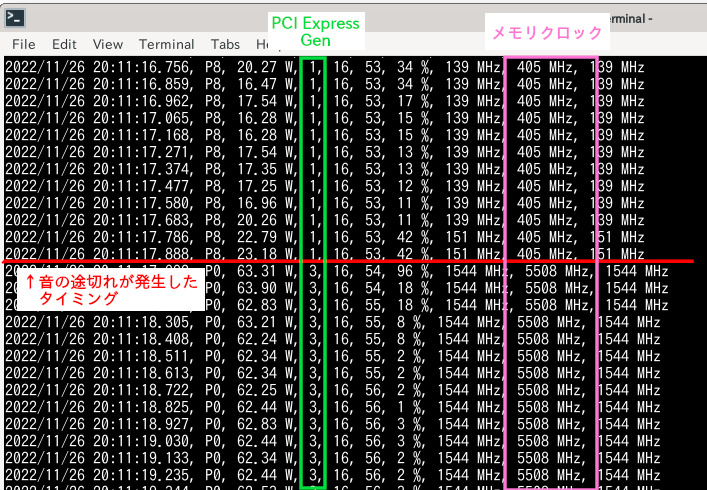

数年前からずっと悩まされていた問題なのだが、
NVIDIAのグラフィックカードのDisplayPort(HDMI) Audioで音声を出力した場合に、
音がときどき途切れてしまうという問題が生じていた。
以前に調べた際には有効な情報を見つけることが出来なかったのだが、
今回この現象の原因及び解決策を見つけることが出来たため、備忘録として記事に残しておく。

# TL;DR

PCI Expressの世代をGen2に制限することで症状を抑制することができる。
これは、マザーボード・GPU間の通信速度の大きな変動を抑制できるためである。

# 環境

今回の問題が生じていた環境は以下の通りである。

- OS: ArchLinux(x86_64)
- マザー: ASUS Z690FORMULA
- GPU: Gefore GTX 1080 Ti
  - DisplayPortにより映像・音声を出力
- GPUドライバ: `nvidia`

自分の環境ではプロプライエタリドライバを用いているが、
オープンカーネルモジュールでも同様の問題が生じていると思われる。

# 現象の原因

今回の現象については、Pipewireのリポジトリにて議論されており原因もここで突き止められている。

[nvidia sound cutting out randomly on external screen (#2375) · Issues · PipeWire / pipewire · GitLab](https://gitlab.freedesktop.org/pipewire/pipewire/-/issues/2375)

ここの情報によると、マザーボード・GPU間の通信速度が大きく変動した際に音の欠落が発生するようである。

実際にそのような変動が発生している可能性があるかどうか確かめるために、以下のコマンドを実行してGPUの通信速度・動作速度等をモニターしてみる。

```sh
$ nvidia-smi --query-gpu=timestamp,pstate,power.draw,pcie.link.gen.current,pcie.link.width.current,temperature.gpu,utilization.gpu,clocks.current.graphics,clocks.current.memory,clocks.current.sm --format=csv -lms 500
```

音の欠落が発生した際、モニターした結果は以下のようになっていた。



確かに途切れが発生したタイミングで動作クロックが大きく上昇している。
また、PCI Expressの通信世代も省電力状態でGen1だったのが途切れが発生したタイミングでGen3に切り替わっている。

# 解決策

音の途切れが発生する原因は通信速度の大きな変化であるため、以下のような解決策をとることができる。

## 通信速度を固定する

以下のいずれかの方法により、動作クロック(≒通信速度)を固定することができる。

1. メモリクロックを固定する(GTX16xx,GTX20xx以降のみ対応)
1. 省電力設定を無効にする

Pipewireのレポジトリで紹介されていたのは1のメモリクロックを固定する方法で、
これは`nvidia-smi --lock-memory-clocks=5508,5508`のようにメモリクロックの最大値と最小値に同じ値を指定することで実現できる。

2はPowerMizerの設定を変更する方法。詳細な設定方法に関しては今回は省略する。

これらの方法により音声の症状は改善するが、動作クロックが不必要に上昇するため、消費電力が無駄に増加することとなる。

## PCI Expressの世代を制限する(おすすめ)

もう一つの方法として、PCI Expressの世代を制限してしまうというものがある。
上記のモニタ結果を見れば分かるように、音の欠落が発生するのは、Gen1→Gen3と大きく世代が動いたときである。
よって、マザーボードの設定等によりPCI Expressの世代をGen2以下に制限してしまうことにより症状が緩和されると考えられる。

今回自分が用いたのもこの方法であり、マザーボードの設定を変更して世代をGen2に制限した。
設定変更の結果、今の所音の欠落は発生しなくなっていると思われる。

{}
PCI Expressの世代を制限した場合、GPUへのデータ転送速度もGen2の規格値に制限されるため、Gen3を用いた場合と比べてゲームのパフォーマンスが低下することが懸念される。
しかし、今日の多くのGPUではVRAMが十分にあるため、実行に必要なすべてのデータを事前に転送できる場合がほとんどである。
このため、実際にGen3ほどの広帯域がリアルタイムに必要とされる場面は少なく、パフォーマンスを損なう可能性は低いと言える。

参考: [PCI Expressの世代が古くてもビデオカードのパフォーマンスは出る](https://akiba-pc.watch.impress.co.jp/docs/dosv/1003385.html)
{}


