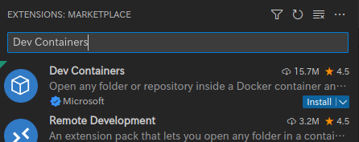
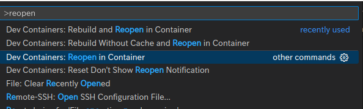

アプリケーション開発を行う上で、開発環境の構築は地味に煩わしい作業の一つである。
VSCodeの拡張機能「Dev Containers」を使うことで、
Dockerfileにより定義された一貫した開発環境を簡単に配布・利用することが可能となる。
今回はGolangを使った実際のアプリケーション開発を想定してDev Containerをセットアップしてみる。

# はじめに

今回はGolang+PostgreSQLによるWebアプリケーション開発を想定し、
以下の要件を満たせるようにする。

- PostgreSQLの開発用データベースが自動的にセットアップされる
- Golangの言語ツール(補完等)を使えるようにする

なお、検証に用いた環境は以下のとおりである。

- ArchLinux x86_64
- Visual Studio Code (binary) 1.73.0
- Dev Containers 0.262.3
- Docker 20.10.21

# Dev Container設定ファイルの作成

Dev Containerの設定ファイルはすべて`.devcontainer/`以下に作成していく。

今回作成するファイルは以下の通り。

```
.devcontainer
├── devcontainer.json
├── docker-compose.yml
└── Dockerfile
```

## docker-compose.ymlの作成

今回は開発用のコンテナの他にDB用のコンテナも必要なので、
それらをまとめて立ち上げるために`docker-compose.yml`を用意する。

```yml
version: '3'

services:
  dev:
    build: .
    stdin_open: true
    volumes:
      - ../:/workspace
  psql:
    image: postgres:15-alpine
    volumes:
      - pgdata:/var/lib/postgresql/data
    environment:
      - POSTGRES_PASSWORD=test
      - POSTGRES_USER=test
      - POSTGRES_DB=test

volumes:
  pgdata:
```

docker-composeを自前で用意する場合、ワークスペース(プロジェクトのディレクトリ)は自力でマウントする必要がある。
今回は`../:/workspace`のようにして`/workspace`にマウントしている。

ちなみに、**開発用コンテナの`stdin_open: true`は必須である**。
これを省略した場合、開発用コンテナが即座に終了してしまう。

{}
`stdin_open: true`を省略すると以下のようなエラーが発生しDev Containerを起動できなくなる。

```
[1096 ms] Start: Inspecting container
[1097 ms] Start: Run: docker inspect --type container e62ecd75e1962b8d908c9890c383290d23af5c518c6378caa38c3c58f86a57f8
[1143 ms] Start: Run in container: /bin/sh
[1152 ms] Start: Run in container: uname -m
[1170 ms] Shell server terminated (code: 1, signal: null)
[1170 ms] Error response from daemon: Container e62ecd75e1962b8d908c9890c383290d23af5c518c6378caa38c3c58f86a57f8 is not running
[1170 ms] Start: Run in container: cat /etc/passwd
[1170 ms] Stdin closed!
```
{}

## Dockerfileの作成

Dockerfileでは、Go言語機能に必要なツールや、PostgreSQLクライアント等をインストールする。

```docker
FROM golang:1.19-bullseye

# Postgresクライアントのインストール
RUN apt -y update \
 && apt -y install postgresql-client

# Go言語ツールのインストール
RUN go install github.com/uudashr/gopkgs/v2/cmd/gopkgs@latest \
  && go install github.com/ramya-rao-a/go-outline@latest \
  && go install github.com/nsf/gocode@latest \
  && go install github.com/acroca/go-symbols@latest \
  && go install github.com/fatih/gomodifytags@latest \
  && go install github.com/josharian/impl@latest \
  && go install github.com/haya14busa/goplay/cmd/goplay@latest \
  && go install github.com/go-delve/delve/cmd/dlv@latest \
  && go install golang.org/x/lint/golint@latest \
  && go install golang.org/x/tools/gopls@latest

WORKDIR /workspace
```

ちなみに、`go install`は必ず一つずつ実行する必要がある。
これは一気にすべてをインストールしようとするとバージョンの解決に失敗するためである。

最後の`WORKDIR /workspace`によって、ターミナルを開いたときにデフォルトでワークスペースに移動するようにしている。

## devcontainer.json

最後にDev Container自体の設定ファイルである`devcontainer.json`を用意する。


```json
{
  "dockerComposeFile": "docker-compose.yml",
  "service": "dev",
  "settings": {
    "terminal.integrated.shell.linux": "bash",
    "go.toolsManagement.checkForUpdates": "off",
    "go.useLanguageServer": true,
    "editor.formatOnSave": false,
    "[go]": {
      "editor.formatOnSave": true
    }
  },
  "workspaceFolder": "/workspace",
  "extensions": [
    "golang.go"
  ]
}
```

まず、`dockerComposeFile`によりカスタムの`docker-compose.yml`を使用することを示す。

次の`service`には、docker-compose内のどのサービスを開発用コンテナとして扱うかを指定する。

`settings`には、Dev Containerを開いた際のVSCodeのコンフィグを書くことができる。
`"terminal.integrated.shell.linux": "bash"`は、指定しなかった場合`sh`がシェルとして起動してしまったので記述している。

`workspaceFolder`にはVSCodeで開くコンテナ上のディレクトリを指定する。(必須)

`extensions`には使用したい拡張機能を指定する。今回はGolangの機能のみがあればいいので`golang.go`を指定している。
なお、ここで指定する拡張機能名は、該当の拡張機能の詳細ページを開いた右下の「More Info」の中の「Identifier」を指定する。

# Dev Containerの起動

まずはVSCodeでプロジェクトのディレクトリを開く。

```sh
$ code .
```

次に、Dev Containersの拡張機能をまだ入れていない場合はインストールする。



インストールしたら、コマンドパレットを開き、「Dev Containers: Reopen in Container」を実行する。



初回はコンテナのビルドが走るため時間がかかる。

完了するとDev Container内のセッションに接続し、Golangの補完等が使えるようになる。

## データベースへの接続

コンテナに`psql`コマンドをインストールしているので、普通に接続することが可能なはずである。

DBのホスト名はdocker-compose.ymlで指定したサービス名`psql`となる。

```sh
root@0b39a3cf6d1a:/workspace# psql -h psql -U test
Password for user test: 
psql (13.8 (Debian 13.8-0+deb11u1), server 15.1)
WARNING: psql major version 13, server major version 15.
         Some psql features might not work.
Type "help" for help.

test=# 
```

# まとめ

今回は開発用コンテナと一緒にDBサーバーを立ち上げる構成を試してみた。

Dockerさえ入っていればWindows, MacOS, Linuxで同じ開発環境を立ち上げられるのはなかなか魅力的である。


